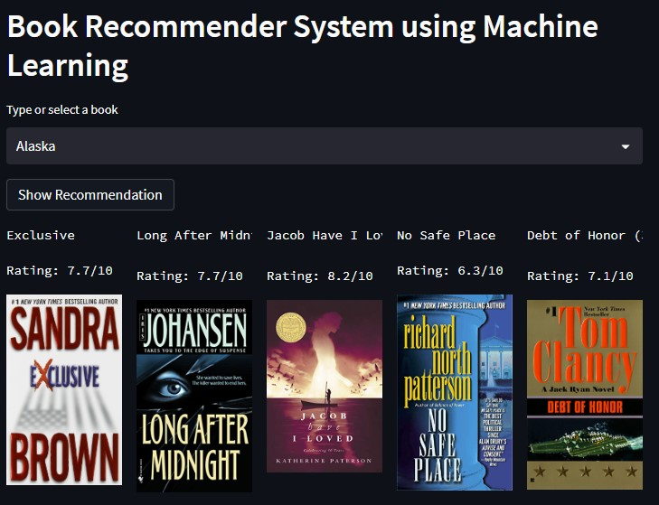

# Book-Recommender-System
Book recommendation system using a collaborative filtering method

A small deployed version of this app can be found [here](https://abhishek-jana-book-rcommender-system-app-yxqqzf.streamlit.app/)

## Features

- **Book search**: Users can search for specific books and view detailed information about them, including ratings and reviews.
- **Recommendation generation**: The system generates book recommendations for each user based on collaborative filtering.

## Setup and Installation

1. Clone the repository:

```shell
git clone ttps://github.com/abhishek-jana/Book-Rcommender-System.git
```

2. Create a new environment using the following command:

```shell
conda create --name myenv
```
3. Activate the newly created environment:

``` shell
conda activate myenv
```
4. Install the required dependencies:

```shell
cd book-recommender-system
pip install -r requirements.txt
```
6. Run the development server:
```shell
streamlit run app.py
```
7. Access the application in your web browser at `http://localhost:8501/`


### APPROACH

The project utilizes the following workflows to generate book recommendations:

1. Book Search: Users can search for specific books and view detailed information, including ratings, reviews, and related books.
2. Recommendation Generation: The system generates book recommendations for each user based on the following method:
   - Collaborative filtering: Recommends books based on the preferences and ratings of similar users.

The system incorporates machine learning algorithms and data processing techniques to analyze user preferences and generate accurate recommendations.


## Results

The system's recommendation generation method, collaborative filtering, helps users discover books aligned with their interests. The user-friendly web interface allows users to search for books and explore detailed information, including ratings, reviews, and related books, enhancing their reading experience.


Here is a screenshot of the book recommendation system app:


## Data Gathering
The book data for this project is gathered from the following sources:

- Goodreads API: An API that provides access to book data, including book titles, authors, genres, ratings, and reviews.

Deployment
The application is deployed using [Streamlit](https://streamlit.io/), an open-source framework for building interactive web applications. The deployment setup instructions can be found in the [Streamlit documentation](https://docs.streamlit.io/streamlit-community-cloud/get-started/deploy-an-app).

## Workflows
The following workflows are implemented in the movie recommendation system:

- **Book search**: Users can search for specific books and view detailed information about them, including ratings and reviews.
- **Recommendation generation**: The system generates book recommendations for each user based on collaborative filtering.

## Project Specific Workflow:
1. Update `config.yaml`.
2. Update `secrets.yaml` (optional) for database credentials.
3. Update `params.yaml`.
4. Update the entity.
5. Update the configuration manager in src config.
6. Update the components.
7. Update the pipeline.
8. Update the main.py.

Please note that these steps are specific to the project and should be followed accordingly for the movie recommendation system.

## Future Work
Some potential areas for future improvement and expansion of the movie recommendation system include:

- Implementing advanced recommendation algorithms, such as matrix factorization and deep learning-based models.
- Enhancing the user interface and user experience of the application.
- Incorporating additional data sources and features, such as user demographics and movie genres, to improve the accuracy of recommendations.
- Creating an account or logging in to an existing account to personalize recommendations based on individual user preferences.
- Allowing users to rate movies they have watched to further improve the accuracy of recommendations.
- Providing personalized movie recommendations specific to existing users based on their viewing history and preferences.
- Implementing a feedback mechanism for users to provide feedback on recommended movies, helping to refine and enhance the recommendation process.

## Contributing
Contributions are welcome! If you have any ideas, bug reports, or feature requests, please open an issue on the [GitHub repository](https://github.com/abhishek-jana/movie-recommendation-system). Pull requests are also appreciated.

## License
This project is licensed under the MIT License.

## Acknowledgements

I would like to acknowledge the following resources and libraries that were instrumental in the development of this movie recommendation system:
- [Streamlit](https://www.streamlit.io/) for the open-source framework used for building the interactive web application.
- [Python](https://www.python.org/) and its various libraries, including [Pandas](https://pandas.pydata.org/), and [Scikit-learn](https://scikit-learn.org/), for their contributions to data processing, machine learning, and recommendation algorithms.

We extend our gratitude to the developers and maintainers of these resources for their valuable contributions to the field of movie recommendation systems.

## References

Here are some helpful references and resources related to movie recommendation systems:

- [Recommendations with IBM](https://github.com/abhishek-jana/Recommendations-with-IBM): A GitHub repository containing a project on building recommendation systems using IBM Watson Studio.
- [Getting Started with a Movie Recommendation System](https://www.kaggle.com/code/ibtesama/getting-started-with-a-movie-recommendation-system): A Kaggle notebook providing an introduction and code examples for building a movie recommendation system.
- [Movie Recommendation System](https://www.kaggle.com/code/darpan25bajaj/movie-recommendation-system/notebook): A Kaggle notebook showcasing the implementation of a movie recommendation system.

These references can provide additional insights, ideas, and code examples for building and enhancing movie recommendation systems.
